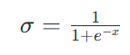
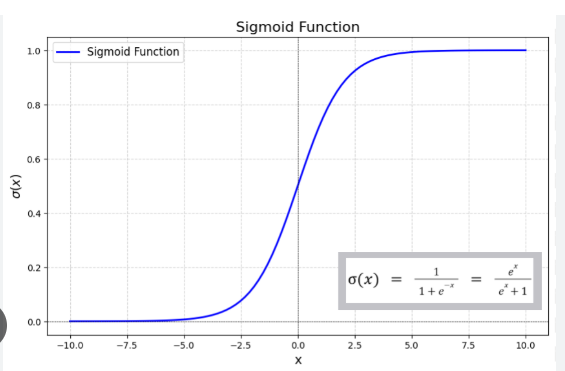

# Logistic Regression

Predicts the probability of an input belonging to a certain category (e.g: Yes/No, Spam/not spam).
* Used for binary classification. but can be extended to multi-class
* Instead of predicting continuos value (like linear regression) it predicts a probability between 0 and 1.

## Real-Life example

Imagine you want to predict whether a student will pass (1) or fail (0) an exam based on their study hours. 
* Linear Regression Problem: Predicts marks (e.g., 75, 90), which can be >100 or <0. 
* Logistic Regression Problem: Predicts probability of passing, e.g., 0.8 (80% chance of passing).

## Sigmoid function (The S curve)

Logistic regression uses the sigmoid function to squeeze the output between 0 and 1.

 or
 ′
 σ(z)=σ(z)⋅(1−σ(z))
Where: 
* where,
x is the input value,
e is Euler's number (≈2.718)
* If σ(z)≥0.5σ(z)≥0.5, predict class 1 (pass). 
* If σ(z)<0.5σ(z)<0.5, predict class 0 (fail).

## Visualization

* The curve looks like an "S" (close to 0 for low study hours, close to 1 for high study hours).

## How does it learn (Intution)

* **Goal** : Adjust weights (b0,b1) so that: 
    * If the true label is 1, predicted probability σ(z) should be close to 1. 
    * If the true label is 0, predicted probability σ(z) should be close to 0.
* **Loss Function (Cross-Entropy)**: Penalizes wrong predictions more if they’re very confident (e.g., predicting 0.9 when the true label is 0).

## Assumptions of Logistic Regression 
1. The dependent variable is **binary** (e.g., yes/no). 
2. No high multicollinearity among features. 
3. Large sample size helps (small samples may lead to overfitting).