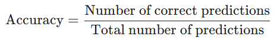
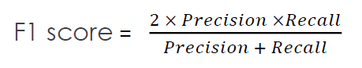
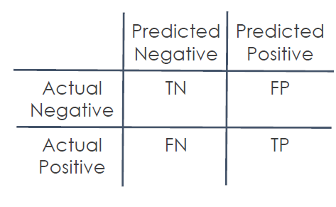
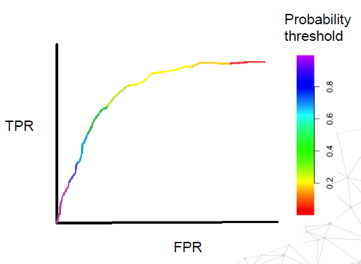
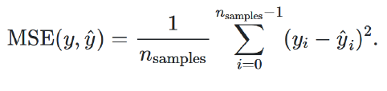
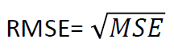
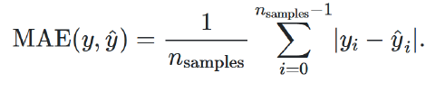
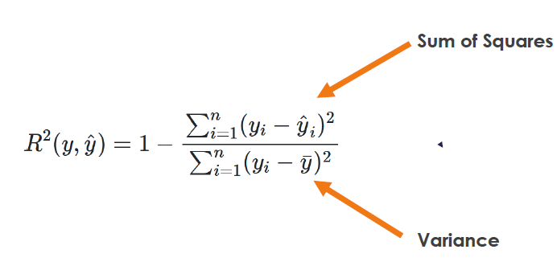

# Metrics

Metrics are quantitative measures used to evaluate model performance. They vary by problem type:

## Classification metrics

These are used for categorical outcomes.

Let's imagine we are building a "spam filter" for emails. Our model gives every email a score from 0 to 100 on how likely it is to be spam.

The big question is: Where do we draw the line? If we decide everything over 50 is spam, we get one set of results. If we move that line to 90, the results change. This "line" is our Probability Threshold.

1. **Threshold-Dependent Metrics**

The "Right Now" View

These metrics change depending on where you set that line (e.g., at 50%). They tell you how the model is performing based on a specific decision rule.

* **Accuracy**: Percentage of correct predictions. How many did we get right overall? (Total correct / Total emails).
    To calculate this, we use a very straightforward ratio

    

Although accuracy is great for general overview. sometimes it can give misleading results, For example, if you are testing for a very rare disease that only 1% of people have, a model could simply guess "No" for everyone and be 99% accurate—even though it failed to find a single sick person!

so use precision and recall to get the full story.

* **Precision**: Percentage of positive predictions that were correct. Of all the emails we called spam, how many actually were? (Quality).
 
    The formula includes:
    Postive Prediction value = TP / (TP + FP)

* **Recall**: Percentage of actual positives that were correctly identified. Of all the real spam out there, how many did we actually catch? (Quantity).
     
     The formula includes:
     TP rate= TP / (TP + FN)

* **F-score**: Harmonic mean of precision and recall. A way to balance Precision and Recall so we don't focus too much on just one.

    The formula includes:
    

* **FPR & FNR (False Positives/Negatives)**: Our "Error" rates. How often did we accidentally block a good email, or let a virus through?

    * False Positive Rate, FPR = FP / (FP + TN)
    * False Negative Rate FNR = FN / (TP + FN)

### Confusion Matrix

A Confusion Matrix is a specialized table used to evaluate how well a machine learning classification model is performing.

In simple terms, it is a "scoreboard" that shows where the model got things right and where it got "confused" by mislabeling one class as another.

* **True Negatives (TN)**: The model correctly said "No".

* **True Positives (TP)**: The model correctly said "Yes".

* **False Positives (FP)**: The "False Alarm." The model said "Yes," but it was actually "No".

*** False Negatives (FN)**: The "Miss." The model said "No," but it was actually "Yes".

---

2. **Threshold-Independent Metrics**

The "Big Picture" View

These metrics don't care where you set the line. Instead, they look at how well the model separates the "Good" from the "Bad" across every possible line you could ever draw.

* **ROC-AUC**: This includes the area under the receiver operating characteristic curve.

    * Think of this as the Model’s IQ.

    * A high score here means that even if we haven't decided where to put the line yet, the model is very good at ranking spam higher than non-spam. It measures the overall potential of the model. 
 
 This plots benefits (TPR) vs costs (FPR ) at different classification thresholds.

 

 * **The X-axis (False Positive Rate)**: This is the "False Alarm" rate. It's how often we incorrectly label a "No" as a "Yes".

* **The Y-axis (True Positive Rate)**: Also known as Recall or Sensitivity. It’s how many of the actual "Yes" cases we successfully caught.

* **ROC-AUC**: area under the ROC curve.

As you move along the curve, you are seeing the trade-off. If you want to catch every single spam email (High Recall), you have to accept that you'll probably block some important work emails too (High False Positives).

* **1.0 (The Perfect Model)**: The curve goes straight to the top-left corner. This model perfectly separates the two groups with zero mistakes.

* **0.5 (The "Coin Flip")**: This is represented by a diagonal line. It means your model is essentially just guessing at random.

* **0.7 to 0.9**: This is where most "good" real-world models live.

---

## Regression metrics

These are used for continuous outcomes like e.g., house prices, temperature, or stock value.

* **Mean Squared Error (MSE)**: Average of squared errors.Instead of taking the absolute value, we square the errors.

    The formula includes:
    
    

* **Root Mean Squared Error (RMSE)**: Square root of MSE.We take the square root of the MSE to bring the number back to our original units.
    
    Squaring the error means that a small mistake is penalized a little, but a huge mistake is penalized massively.

    The formula includes:

    

* **Mean Absolute Error (MAE)**: Average of absolute errors.This is the simplest metric. It tells you, on average, how many units your prediction was off by.

    We take the distance between each prediction and the actual value, make them all positive (absolute value), and average them.

    The formula includes:

    

* **R-squared Error**: Proportion of variance explained by the model.

    The "Model IQ"
    While MAE and RMSE tell you "how much error" you have, $R^2$ tells you "how much of the story" your model explains.

    The formula includes:

     

*   * **The Scale**: It usually ranges from 0 to 1 (or 0% to 100%).
    * **Interpretation**: * $R^2 = 0.80$: Your model explains 80% of the variation in the data.$R^2 = 0$: Your model is no better than just guessing the average value for every single prediction.

---

## Loss Function

If the metrics in your image are the "final grade," the Loss Function is the "tutor" that corrects the model during practice. It measures the distance between the model's predicted probability (p) and the actual true label (y).

We use loss function while actually training the model. this ncludes MSE, MAE, Hinge Loss, Log Loss, etc. during classification tasks, the most common loss function is Binary Cross-Entropy, also known as Log Loss.

* **Goal**: We want to minimize this "distance" or loss as much as possible.

* **Penalty**: It doesn't just care if the model is wrong; it cares how confident the model was while being wrong.

The formula for a single prediction looks like this:

Loss = -(y \log(p) + (1 - y) \log(1 - p))

* **If the true label is 1 (e.g., Spam)**: The second half of the formula becomes zero. The model is penalized based on $-\log(p)$. If it predicted $0.99$, the loss is tiny. If it predicted $0.01$, the loss is huge.

* **If the true label is 0 (e.g., Not Spam)**: The first half becomes zero. Now, the model is penalized for $-\log(1-p)$.

### Binary cross entropy

This is used for yes/no classification.

Binary Cross Entropy is a specific type of loss function. Using the same analogy, if Loss Function is "Exercise," then Binary Cross Entropy is **"Running."** It is a specific routine designed for a specific goal: Binary Classification (predicting one of two classes).

* **Its job**: It measures the performance of a classification model whose output is a probability value between 0 and 1.

* **How it works**: It penalizes the model based on how far the predicted probability is from the actual label (0 or 1).

    * If the model is confidently wrong (predicts 0.99 when the answer is 0), BCE gives a massive penalty.

    * If the model is confidently right, the penalty is nearly zero.

---

## In Scikit-learn:

Scikit-learn provides these metrics in its metrics module. They're used by:

1. Importing the relevant metric function 
2. Passing true values and predictions to the function 
3. For hyperparameter tuning, the metric is specified in the search object (like GridSearchCV).

Not all metrics available, but we can make our own metrics with the [make_scorer](https://scikit-learn.org/stable/modules/generated/sklearn.metrics.make_scorer.html)

Scikit-learn maximizes the negated version of that metric.

* **Standard Goal**: Lower is better (e.g., you want an MSE of 10 rather than 100).

* **Scikit-learn Logic**: Higher is better. By turning the number negative, it treats the "best" score as the one with the highest mathematical value.

    * If Model A has an MSE of 10 and Model B has an MSE of 100, Model A is clearly the winner.

    * Scikit-learn converts these to -10 and -100.
    
---

## Creating Custom Metrics: 

You can define your own metrics when standard ones don't capture your specific needs. 
This involves: 
1. Creating a function that takes true values and predictions 
2. Implementing your custom calculation 
3. Ensuring it returns a single numerical value (higher=better or lower=better) 
4. Using it in your model evaluation or hyperparameter search