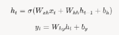

# Recurrent Neural Networks (RNNs)

A Recurrent Neural Network (RNN) is a type of artificial neural network designed for processing sequential data, such as time series, natural language, or speech. Unlike traditional feedforward neural networks, RNNs have a "memory" mechanism that allows them to use information from previous inputs to influence the current output.

RNNs are ideal for tasks where context or order matters, e.g., predicting the next word in a sentence or analyzing stock prices over time.

They handle sequences by maintaining a hidden state that captures information from earlier steps in the sequence.

## How RNNs work

* **Structure**:

    * RNNs process sequences one element at a time (e.g: words in a sentence).
    
    * At each time step t, the network takes:
        * An output $$X_i$$ (e.g: a word or data point)
        * A hidden state $$h_i-1$$ from previous time step which acts as memory
    
    * It produces:
        * An output $$y_i$$ (optional depending on the task).
        * A new hidden state $$h_t$$ which is passed to next time step
    
    * Mathematically:

        

        where,
        * $$W_xh$$ : weight matrix for input to hidden connections.
        * $$W_hh$$ : weight matrix for hidden to hidden connections (recurrence).
        * $$W_hy$$ : weight matrix for hidden to output connections
        * $$b_h * b_y$$ : bias terms
        * $$σ$$ : Activation function (e.g: tanh or ReLU)

* **Recurrence** : The same weights ($$W_xh,W_hh,W_hy$$) are shared across all time steps making RNNs parameter-efficient and suitable for sequences of varying heights

## Why RNNs are special

* **Sequential Processing**: RNNs process data in order, capturing dependencies between elements (e.g., "I am" influences "hungry" in a sentence).
* **Memory**: The hidden state carries information from earlier steps, allowing the network to "remember" past context.
* **Flexibility**: RNNs can handle variable-length inputs and outputs, unlike feedforward networks that require fixed-size inputs.

## Types of RNNs

* **One-to-One**: Single input, single output (like a standard neural network).
* **One-to-Many**: Single input, multiple outputs (e.g., image captioning).
* **Many-to-One**: Sequence input, single output (e.g., sentiment analysis).
* **Many-to-Many**: Sequence input, sequence output (e.g., machine translation).

## Training RNNs

* **Backpropagation Through Time (BPTT)**:
    * RNNs are trained using a variant of backpropagation called BPTT.
    * The network is "unrolled" across time steps, treating it as a deep feedforward network.
    * Gradients are computed for each time step and summed to update weights.

* **Loss Function**: Depends on the task (e.g., cross-entropy for classification, mean squared error for regression).

* **Challenges**:
    * **Vanishing Gradients**: Gradients can become very small, making it hard for the network to learn long-term dependencies.
    * **Exploding Gradients**: Gradients can grow too large, causing unstable training.
    * **Solutions**: Techniques like gradient clipping and advanced architectures (LSTM, GRU) address these issues.

## Limitations of basic RNNs

* **Short-Term Memory**: Basic RNNs struggle to capture long-term dependencies due to vanishing gradients.
* C**omputational Cost**: Long sequences require unrolling the network for many time steps, increasing computation.
* **Overfitting**: RNNs can overfit on small datasets, requiring regularization (e.g., dropout).

## Advanced RNNs

To overcome the limitations of basic RNNs, introduce your candidate to these advanced architectures:

* **Long Short-Term Memory (LSTM)**:
    * Introduces memory cells and gates (input, forget, output) to selectively remember or forget information over long sequences.
    * Solves the vanishing gradient problem.

* **Gated Recurrent Unit (GRU)**:
    * A simpler alternative to LSTM with fewer gates (update and reset), balancing performance and efficiency.

* **Bidirectional RNNs**:
    * Process sequences in both forward and backward directions, useful for tasks where future context matters (e.g., speech recognition).

* **Attention Mechanisms**:
    * Allow the network to focus on specific parts of the input sequence, improving performance in tasks like translation (leads to Transformers).

## Applications of RNNs

* **Natural Language Processing (NLP)**: Language modeling, machine translation, sentiment analysis, text generation.
* **Time Series Analysis**: Stock price prediction, weather forecasting.
* **Speech Processing**: Speech recognition, text-to-speech.
* **Video Analysis**: Frame-by-frame sequence processing.